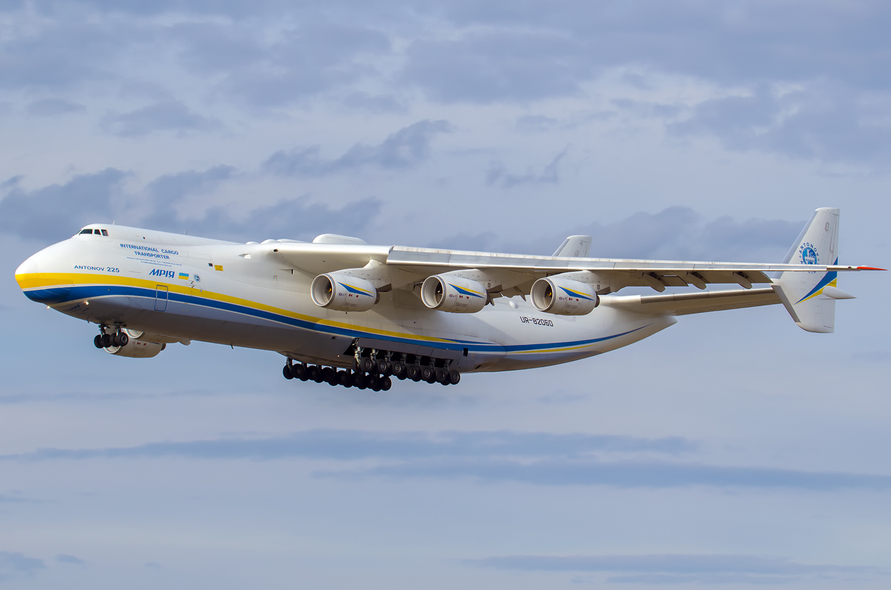
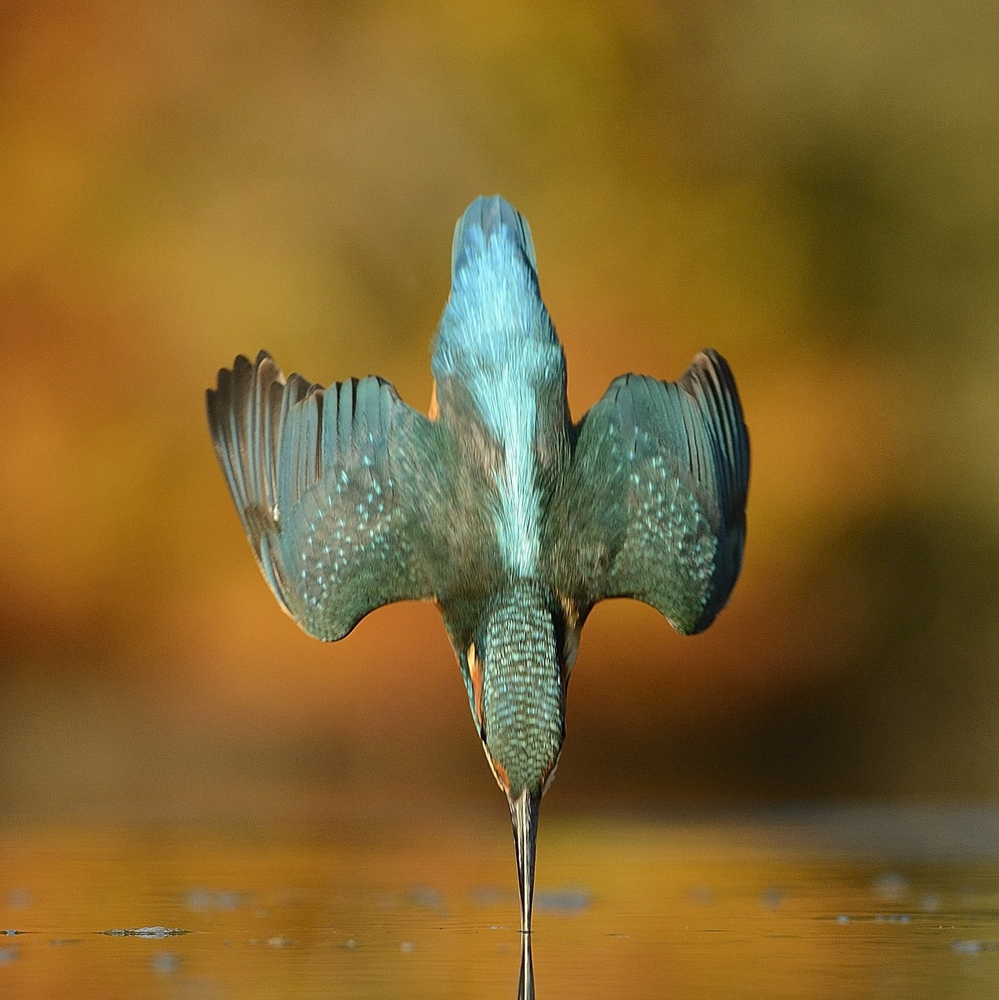
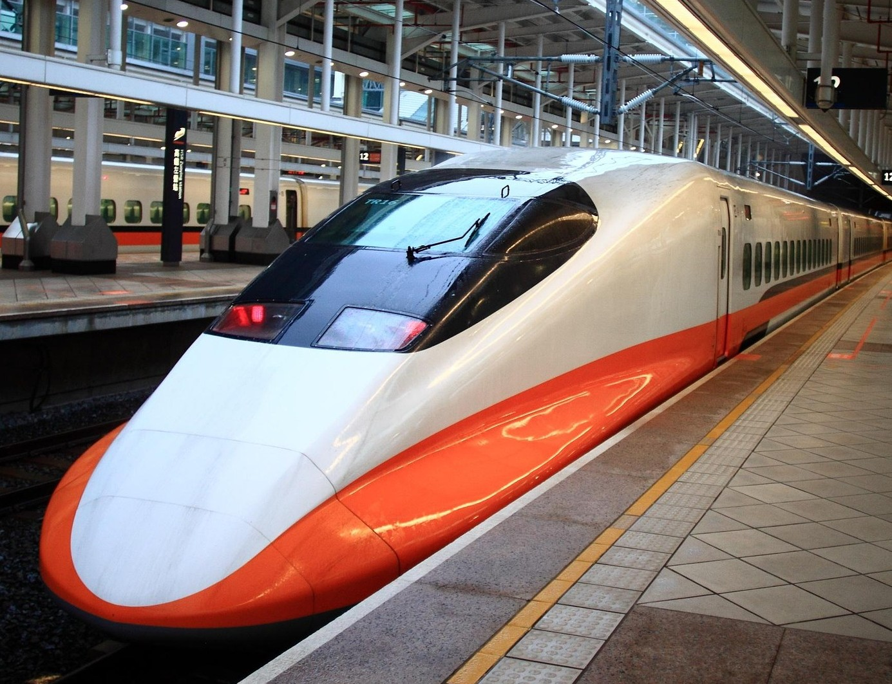
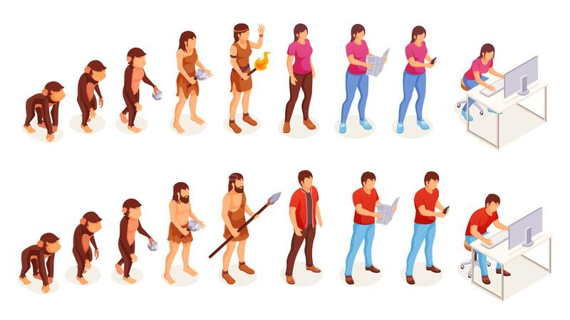
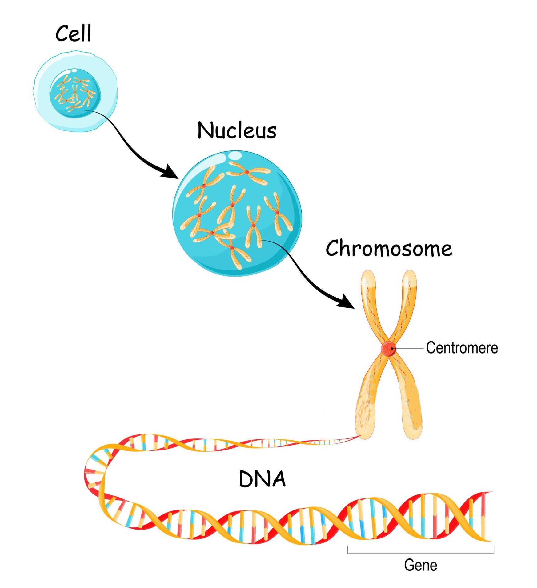

class: middle, center, title-slide

# Основи натхнених природою обчислень

Лекція 1: Вступ до еволюційних обчислень

  
Кочура Юрій Петрович 
[iuriy.kochura@gmail.com](mailto:iuriy.kochura@gmail.com)  
<a href="https://t.me/y_kochura">@y_kochura</a>  

---

class:  black-slide, 
background-image: url(./figures/lec1/gen.jpg)
background-size: cover

# Сьогодні

.larger-x[ 
 

🎙️ Навіщо вчитися у природи?  
🎙️ Біоніка   
🎙️ Теорiя еволюцiї за Дарвіном   
🎙️ Еволюційні алгоритми: термінологія  
🎙️ Штучна еволюція на практиці      
🎙️ Відомі алгоритми еволюційних обчислень  
🎙️ Бібліотеки та фреймворки для еволюційних обчислень  

]

---

class: blue-slide, middle, center
count: false

.larger-xx[Навіщо вчитися у природи?]

---

class: middle, black-slide, center

# Алгоритми в природі

.grid[
.kol-1-2[
<iframe width="460" height="215" src="https://www.youtube.com/embed/PGquZTg5qXs?start=30&autoplay=1&loop=1&controls=0&mute=1" frameborder="0" allow="accelerometer; autoplay; encrypted-media; gyroscope; picture-in-picture" allowfullscreen></iframe>

 <iframe width="460" height="215" src="https://www.youtube.com/embed/bFbJhl9W89Q?start=0&autoplay=1&loop=1&controls=0&mute=1" frameborder="0" allow="accelerometer; autoplay; encrypted-media; gyroscope; picture-in-picture" allowfullscreen></iframe>
]

.kol-1-2[
<iframe width="460" height="215" src="https://www.youtube.com/embed/UQKC5pZ0FG8?autoplay=1&loop=1&controls=0&mute=1" frameborder="0" allow="accelerometer; autoplay; encrypted-media; gyroscope; picture-in-picture" allowfullscreen></iframe>

<iframe width="460" height="215" src="https://www.youtube.com/embed/a1wp1RnC7kk?autoplay=1&loop=1&controls=0&mute=1" frameborder="0" allow="accelerometer; autoplay; clipboard-write; encrypted-media; gyroscope; picture-in-picture" allowfullscreen></iframe>

]]

???
Природа &mdash; це результат мільярдів років еволюції, яка вирішувала складні задачі оптимізації, адаптації та виживання. Наслідування природи дозволяє нам запозичувати ці рішення для науки, техніки та штучного інтелекту.

Алгоритм життя &mdash; це концепція, яка описує еволюцію як алгоритмічний процес, який керує розвитком життя через механізми природного відбору, мутації та рекомбінації.

Еволюція &mdash; це природний алгоритм, що формує життя. Розуміння основних принципів еволюції допомагає не лише в біології, а й у розробці штучного інтелекту, оптимізації моделей та адаптивних систем.

---

class: middle

# Біоніка

.alert[
.larger-x[.bold[Біоніка], .bold[біоміметика] або .bold[біомімікрія] &mdash;  наука, що вивчає застосування принципів дії живих систем і використання біологічних процесів для вирішення інженерних завдань.]]

.center[<iframe width="400" height="250" src="https://www.youtube.com/embed/_KowHG5Wbgk?autoplay=1" frameborder="0" allowfullscreen></iframe>]

.footnote[Джерело: [ЕНЦИКЛОПЕДІЯ СУЧАСНОЇ УКРАЇНИ](https://esu.com.ua/article-35330).]

???

Biomimicry (біомімікрія, біоміметика) &mdash; це наука і підхід до проєктування, який базується на запозиченні рішень із природи для створення технологій, матеріалів, процесів та систем. 

Природа як вчитель &mdash; вивчення живих організмів та екосистем для знаходження ефективних рішень.

---

- Природа у ході еволюції розробила ефективні методи вирішення задач обробки інформації
- Методи, що імітують такі природні процеси, часто називають .highlight.bold[«натхнені природою»]

.bold[Приклад 1:] конструкція крила літака

.grid[
.kol-1-2.width-100.center[]
.kol-1-2.width-95.center[]

]

???
Птахи мають особливу форму крил, що мінімізує енергетичні витрати під час польоту, зменшуючи турбулентність і підвищуючи маневреність. Це надихнуло на розробку крил, що мають спеціально профільовану форму для зменшення опору повітря та підвищення аеродинамічної ефективності.

У природі птахи можуть змінювати форму своїх крил, адаптуючи їх під різні умови польоту (швидкість, напрямок вітру). У сучасних літаках також почали використовувати технології для регулювання форми крил залежно від умов польоту, що дозволяє підвищити ефективність і зменшити витрати пального.

Природа забезпечує птахам високу міцність крил при мінімальній масі. Це стало натхненням для створення легких, але міцних матеріалів для конструкції літаків, зокрема використання композитних матеріалів для крил.

Імітація конструкції крил птахів дозволила не тільки підвищити ефективність літаючих апаратів, але й зробити їх більш екологічними, зменшуючи споживання пального та викиди в атмосферу.

---

class: middle

.bold[Приклад 2:] швидкісні поїзди з новим дизайном передньої частини

.grid[
.kol-1-2.width-85.center[]
.kol-1-2.width-100.center[]

]

???
Одним із чудових прикладів біоніки є швидкісні поїзди, зокрема, швидкісні поїзди типу "Шинкансен" в Японії. Їх конструкція була значно вдосконалена завдяки натхненню природою, зокрема від птаха королівського снігура або зимородок (Kingfisher), який має надзвичайно аеродинамічний дзьоб.

Птах королівський снігур має довгий, загострений дзьоб, що дозволяє йому ефективно входити у воду, не створюючи при цьому сильних хвиль або турбулентності. Архітектори поїзда застосували подібний принцип для створення передньої частини локомотива, зробивши його гладким і загостреним, щоб зменшити опір повітря і підвищити швидкість.

Подібно до того, як птахи при польоті не створюють великого шуму завдяки своїй аеродинамічній формі, швидкісні поїзди з новим дизайном передньої частини зменшили шум при русі, особливо при проходженні через тунелі. Це дозволяє знизити рівень шуму, що часто є проблемою для мешканців, що живуть поблизу залізничних шляхів.

Вдосконалений дизайн допомагає значно зменшити енергетичні витрати поїзда, так як він зменшує опір повітря, що дозволяє рухатись швидше і з меншими витратами енергії.

---

class: middle, black-slide, center

.center[<iframe width="600" height="450" src="https://www.youtube.com/embed/Je8wxnoEkug?autoplay=1" frameborder="0" allowfullscreen></iframe>]

???
Ідея імітувати польоти птахів при проєктуванні літаків була популярною серед ранніх авіаторів. Однак, з часом стало зрозуміло, що цей підхід має суттєві обмеження.

Оскільки птахи використовують м'язові рухи для підйому та маневрування, це вимагає значної енергії. Такі методи не підходять для літаків, оскільки вони потребують значно меншої енергії для підтримки польоту.

Ідея імітувати польот птахів при проєктуванні літаків була популярною на ранніх етапах авіації. Однак, згодом стало зрозуміло, що цей підхід не є оптимальним. Наприклад, Леонардо да Вінчі, який розробляв концепцію літаючого апарата, спирався на спостереження за птахами, але його конструкції не були практичними.

Літак не птах. Він не може літати, як птах. Це вказує на те, що конструкція літака повинна базуватися на наукових дослідженнях та інженерних розрахунках, а не виключно на спостереженнях за природою.

Природа показала нам шлях, але не дала готового рішення. Перш ніж літати, ми мали зрозуміти закони аеродинаміки.

---

class: middle

# Еволюція

.width-100.center[]

---

class: middle

# Еволюційні алгоритми

.grid[
.kol-3-4[
- Потомство, створене шляхом схрещування,  мутації тощо
- Природний відбір &mdash; процедура керованого пошуку
- Індивіди, які краще адаптовані до умов, виживають, розмножуються та передають свою генетичну інформацію нащадкам
- Популяції пристосовуються до умов навколишнього середовища. Варіації накопичуються з часом, створюючи нові види
]
.kol-1-4.width-90.center[   .bold[Чарлз Дарвін] (.bold[1809-1882])]

]

???
 Рекомбiнацiя i мутацiя дозволяють iндивiдамзмiнюватись i пристосовуватися все краще з кожним поколiнням до умов середовища.

---

class: middle

# Еволюційні алгоритми: термінологія

- .bold[Ген] &mdash; найменша одиниця інформації в хромосомі.
- .bold[Індивід] &mdash;  один з можливих розв’язкiв проблеми, несе генетичну інформацію (хромосому). 
- .bold[Популяція] &mdash; сукупність індивідів.
- .bold[Покоління] &mdash; набір всіх індивідів (хромосом), що існують на певному етапі виконання алгоритму. Кожне нове покоління генерується з попереднього шляхом операцій відбору, схрещування та мутацій.
- .bold[Функція допасованості] або .bold[«фітнес-функція»] часто використовується як синонім цільової функції.

???
Ген містить частину закодованого розв'язку, що впливає на пристосованість індивіда. Сукупність генів утворює хромосому, яка є потенційним розв’язком оптимізаційної задачі.

Покоління &mdash; це одна ітерація еволюційного процесу, в якій створюється нова популяція індивідів (розв'язків-кандидатів) на основі поточної.

Функція допасованості  &mdash; визначає на скільки індивід пристосований до вирішення поставленої задачі.

---

class: middle

.width-75.center[]

---

class: middle

.width-100.center[]

---

class: middle

# Загальна ідея

- .bold[Відбір] &mdash; рулетковий, турнірний тощо.
- .bold[Мотивація] &mdash; зберегти найкращі індивіди (створюючи кілька копій) і усунути найгірші.
- .bold[Схрещування] &mdash; імітоване бінарне схрещування, лінійне схрещування, змішане схрещування тощо.
- .bold[Створення нових розв'язків], які ймовірно будуть кращими.
- .bold[Мутація] &mdash; поліноміальна мутація, випадкова мутація тощо.
- Збереження різноманітності у популяції
  - 010110 → 010100 (побітова мутація).

---

# Штучна еволюція на практиці

.grid[
.kol-1-2[
  <iframe width="360" height="215" src="https://www.youtube.com/embed/v9ofyPwzkxA?start=7&autoplay=1&mute=1&loop=1" frameborder="0" allow="accelerometer; autoplay; encrypted-media; gyroscope; picture-in-picture" allowfullscreen></iframe>

  <iframe width="360" height="215" src="https://www.youtube.com/embed/z9ptOeByLA4?start=27&autoplay=1&mute=1&loop=1" frameborder="0" allow="accelerometer; autoplay; encrypted-media; gyroscope; picture-in-picture" allowfullscreen></iframe>
]

.kol-1-2[
<iframe width="360" height="215" src="https://www.youtube.com/embed/qv6UVOQ0F44?start=285&autoplay=1&mute=1&loop=1" frameborder="0" allow="accelerometer; autoplay; encrypted-media; gyroscope; picture-in-picture" allowfullscreen></iframe>

<iframe width="360" height="215" src="https://www.youtube.com/embed/IHQgnpSphEI?start=27&autoplay=1&mute=1&loop=1" frameborder="0" allow="accelerometer; autoplay; clipboard-write; encrypted-media; gyroscope; picture-in-picture" allowfullscreen></iframe>

]]

---

class: middle

# Історичний огляд

- .bold[1948, Тюрінг:]
 запропонував "генетичний або еволюційний пошук".
- .bold[1962, Бремерманн:]
оптимізація через еволюцію та рекомбінацію.
- .bold[1964, Рехенберг:] запровадив еволюційні стратегії.
- .bold[1965, Фогель, Оуенс і Волш:] запровадили еволюційне програмування.
- .bold[1975, Голланд:] запровадив генетичні алгоритми.
- .bold[1992, Коза:] запровадив генетичне програмування.

???
Хоча Алан Тюрінг не розробив повноцінний метод, його ідея стала натхненням для майбутніх досліджень у цій сфері.

Ханс-Йоахим Бремерманн досліджував еволюційні методи оптимізації та механізми рекомбінації (перехресне схрещування генів), які є ключовими у біологічній еволюції. Основна задача полягала у розробці методів, що імітують еволюційні процеси для вирішення задач оптимізації. Дослідження Бремерманна заклали основу для генетичних алгоритмів та інших еволюційних підходів.

Інго Рехенберг розробив метод еволюційних стратегій, який базується на стохастичних мутаціях та відборі найкращих рішень. Основна задача еволюційних стратегій полягає в оптимізації технічних і механічних систем. Приклад застосування: оптимізація форми профілів крила літаків.

Фогель і його колеги запропонували еволюційне програмування, яке схоже на еволюційні стратегії, але більше орієнтоване на розвиток поведінки та автоматів.
Основна задача: створення адаптивних систем, що можуть навчатися та розвиватися.
Приклад застосування: моделювання розумової діяльності штучних агентів.
Значення: заклало основу для адаптивних систем і машинного навчання.

Джон Голланд представив генетичні алгоритми (GA) – метод оптимізації, що імітує природний добір через мутації, схрещування та відбір.
Основна задача: вирішення складних комбінаторних задач.
Приклад застосування: оптимізація маршрутів, нейронні мережі, розклад завдань, обробка сигналів.
Значення: GA став одним із найпоширеніших методів у сфері оптимізації та штучного інтелекту.

Джон Коза розширив ідею генетичних алгоритмів та запропонував генетичне програмування (GP), де еволюційний пошук застосовується до структур комп'ютерних програм.
Основна задача: автоматична генерація програм для вирішення складних задач.
Приклад застосування: створення ефективних програм без ручного програмування, генерація алгоритмів для робототехніки, фінансового аналізу.
Значення: зробило можливим автоматизоване програмування на основі еволюційних методів.

Еволюційні обчислення розвивалися через поступове удосконалення ідей – від концепту Тюрінга до сучасного генетичного програмування. Кожен етап зробив внесок у розвиток методів оптимізації та адаптивних систем, які сьогодні широко застосовуються в науці, техніці та штучному інтелекті.

---

class: middle

# Відомі алгоритми

- .bold[CMA-ES (Covariance Matrix Adaptation Evolutionary Strategy)]

Стратегія еволюції з адаптацією ковариаційної матриці &mdash; метод оптимізації для неперервних параметрів.
- .bold[NSGA-II (Non-dominated Sorting Genetic Algorithm II)]

Генетичний алгоритм із сортуванням нерівноцінних розв'язків (друга версія) &mdash; популярний метод для багатокритеріальної оптимізації.
- .bold[NEAT (Neuroevolution of Augmenting Topologies)]

Нейроеволюція доповнювальних топологій &mdash; метод навчання нейронних мереж за допомогою еволюційних алгоритмів.

- .bold[MAP-Elites]

Метод пошуку елітних розв'язків через картування простору розв'язків &mdash; техніка для дослідження різноманітності розв'язків.

???
Основна задача CMA-ES: неперервна оптимізація функцій. Використовує коваріаційну матрицю для моделювання розподілу ймовірностей серед можливих розв'язків. Покращує вибір параметрів шляхом адаптації розподілу зразків у просторі розв'язків. 
Приклади застосування:
- Оптимізація гіперпараметрів нейронних мереж.
- Управління роботами та адаптивне навчання.
- Технічні задачі, як-от аеродинамічне проектування.

Значення: ефективний метод для нелінійних, складних і безградієнтних функцій.

NSGA-II використовує парето-оптимальність, щоб знайти набір розв'язків, які є кращими за інші за одним критерієм, але не гіршими за всіма іншими. Використовує краще ранжування та відбір, ніж класичний NSGA, що знижує обчислювальні витрати.

Приклад застосування:

- Оптимізація ресурсів у промислових процесах.
- Генетичний дизайн матеріалів.
- Балансування між продуктивністю та енергоспоживанням у вбудованих системах.

Значення: один із найефективніших методів для розв’язання задач з конфліктуючими цілями.

Основна задача NEAT: еволюція архітектури нейронних мереж разом із їхніми вагами.

Принцип роботи:
- Використовує еволюційні оператори (мутації та схрещення) для зміни топології мережі.
- Починає з простих архітектур і поступово додає нові нейрони та зв’язки.
- Застосовує фенотипову різноманітність, щоб уникнути передчасної конвергенції.

Приклад застосування:
- Розробка нейромереж для ігрових агентів та автономних систем.
- Управління складними динамічними системами.
- Еволюційний дизайн архітектури ШІ.

Значення: дозволяє не лише оптимізувати ваги, а й автоматично знаходити ефективні архітектури нейромереж.

Основна задача MAP-Elites: еволюція поведінки, пошук різноманітних розв'язків, а не лише одного найкращого.

Принцип роботи:
- Простір розв'язків розбивається на дискретні комірки, кожна з яких відповідає певному критерію.
- В кожній комірці зберігається найкращий знайдений розв'язок.
- Алгоритм поступово заповнює карту, знаходячи різноманітні, але водночас ефективні розв'язки.

Приклад застосування:
- Еволюція поведінки роботів (наприклад, різні стилі ходи).
- Генерація штучних ландшафтів і творчий дизайн.
- Оптимізація механізмів у фізичних симуляціях.

---

class: middle

# Бібліотеки та фреймворки

Бібліотеки та фреймворки для еволюційних обчислень у різних мовах програмування:

- .bold[[ECJ (Java)](https://cs.gmu.edu/~eclab/projects/ecj/):]  фреймворк для еволюційних обчислень
- .bold[[GPLAB (MATLAB)](https://gplab.sourceforge.net/):] бібліотека для генетичного програмування
- .bold[[Optimization Toolbox (MATLAB)](https://www.mathworks.com/products/global-optimization.html):] вбудований інструмент MATLAB для оптимізації, включаючи генетичні алгоритми
- .bold[[pycma (Python)](https://github.com/CMA-ES/pycma):] бібліотека CMA-ES (Covariance Matrix Adaptation Evolution Strategy) для неперервної оптимізації.
- .bold[[pymoo (Python)](https://pymoo.org/):] бібліотека для багатоцільової оптимізації в Python.
- .bold[[MABE (C++)](https://github.com/Hintzelab/MABE):] фреймворк для моделювання еволюції агентів.
- .bold[[eaopt (Go)](https://github.com/MaxHalford/eaopt):] реалізація стандартних еволюційних операторів.

.bold.center[та інші ...]

???
ECJ підтримує генетичні алгоритми (GA), генетичне програмування (GP), еволюційні стратегії (ES), коеволюцію та інші методи.

Застосування: академічні дослідження, складні оптимізаційні задачі, моделювання.

GPLAB використовує деревоподібні структури для автоматичної генерації програм. Має гнучку реалізація операторів схрещування, мутації та відбору.

Застосування: автоматична розробка програм, еволюційне проектування, фінансовий аналіз.

Можливості Optimization Toolbox:
- Реалізація стандартних еволюційних алгоритмів.
- Інтеграція з іншими математичними функціями MATLAB.

Застосування: інженерні розрахунки, дослідження операцій, задачі оптимізації.

Можливості pycma:
- Ефективний метод для оптимізації безградієнтних функцій.
- Легка інтеграція з іншими науковими бібліотеками Python (NumPy, SciPy).

Застосування: машинне навчання, нейроеволюція, параметрична оптимізація.

---

class: middle, black-slide, center

<iframe width="600" height="450" src="https://www.youtube.com/embed/P_fHJIYENdI" frameborder="0" allowfullscreen></iframe>

Найкорисніша річ, яку коли-небудь зробив ШІ

---

class: end-slide, center
count: false

.larger-xxxx[🏁]